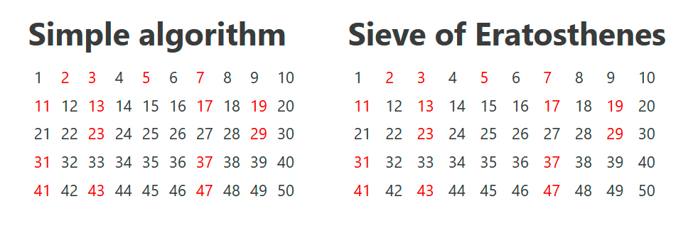

# Prime numbers: SCSS only

 
I was wondering if it is possible to implement some useful algorithms on SCSS. Well, here is a simple primality test and the sieve of Eratosthenes.

## How It Works
### Simple test
Implemented in the `is_prime () 'function in the `simple.scss' file. In it, we iterate through all possible odd divisors up to the square root of the divisible, and if the divisor was not found (meaning, if the number is prime), we return `true`.

### Sieve of Eratosthenes
Implemented in the `eratosthenes.scss` file. After running this code, the `primes` list will be created. For primes, the value of the corresponding index (starting from 1) will be `true`. This algorithm is not optimal. In SCSS, you cannot replace a list element by its index. To get around this, the `sift ()` function was created, which performs n more actions at each iteration, which is why the complexity of the algorithm is close to _O(n2)_.

### Сoloring the tables
To display the output data, two tables are used (file `index.html`). The number of cells (which corresponds to the maximum number you are looking for) is written in the file `config.scss` in the variable `max_el`. If the number is simple, it will be colored red. This is implemented in the `style.scss` file - we just check each number from 1 to `$max_el` in one of the above ways.

## How to Use It
1. Clone this project locally;
2. In the main directory, run the `npm i` command to install all the necessary packages;
3. To start the live server, run the command `npm run dev` or just `gulp`. 
You can also explore this online at [Codepen](https://codepen.io/dan-sazonov).

## Contributing
If you have any ideas or found any bugs here, plz open the [issue](https://github.com/dan-sazonov/prime-numbers-scss/issues) or make a fork and offer a [pull request](https://github.com/dan-sazonov/prime-numbers-scss/pulls). And it will be great if you tell me about these ideas, maybe I'm already working on them.

## License
Code released under the [MIT License](https://github.com/dan-sazonov/prime-numbers-scss/blob/main/LICENSE). You can use the code for any purpose by providing a link to the author.

## Author
The author of this repository and code - [@dan-sazonov](https://github.com/dan-sazonov).  
**Reach me:** 
[:airplane: Telegram](https://t.me/dan_sazonov)  
[:e-mail: Email](mailto:p-294803@yandex.com)  
